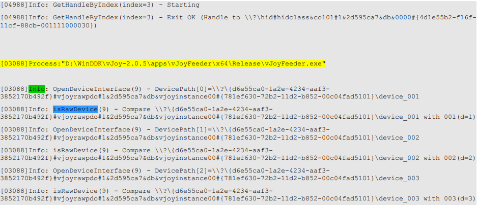

# C# vJoy Feeder/Receptor SDK

*Version 2.1.8 -- November 2016*

**Table of Contents**

[**C# vJoy Feeder/Receptor SDK**](#c-vjoy-feederreceptor-sdk)  
[**File listing**](#file-listing)  
[**Fundamentals**](#fundamentals)  
[**Recomended Practices**](#recomended-practices)  
    - [Test vJoy Driver](#test-vjoy-driver)  
    - [Test Interface DLL matches vJoy Driver](#test-interface-dll-matches-vjoy-driver)  
    - [Test vJoy Virtual Devices](#test-vjoy-virtual-devices)  
    - [Acquire the vJoy Device](#acquire-the-vjoy-device)  
    - [Feed vJoy Device](#feed-vjoy-device)  
    - [Relinquish the vJoy Device](#relinquish-the-vjoy-device)  
    - [Detecting Changes](#detecting-changes)  
    - [Force Feedback Receptor Unit](#receptor-unit)  
[**Interface Function Reference**](#interface-function-reference)  
    - [General driver data](#general-driver-data)  
    - [Write access to vJoy Device](#write-access-to-vjoy-device)  
    - [vJoy Device properties](#vjoy-device-properties)  
    - [Robust write access to vJoy Devices](#robust-write-access-to-vjoy-devices)  
    - [Force FeedBack Functions](#ffb-functions)  
    - [FFB Helper Functions](#ffb-helper-functions)  
[**Build & Deploy**](#build-deploy)  
    - [Location of `vJoyInterface.dll`](#location-of-vjoyinterface.dll)  
[**Logging**](#logging)  
    - [Start/Stop Logging](#startstop-logging.)  
    - [Log File](#log-file)  

This SDK includes all that is needed to write a feeder for vJoy version 2.1.8

Check for the latest [C# SDK](https://github.com/njz3/vJoy/tree/master/SDK/c%23).

## File listing
|                                       |  |                   
|---------------------------------------|-----------------------------------------|
| `c#`\                                |C# SDK (This folder)
| `x86\`                               |Library folder (x86)|
| `x86\vJoyInterface.dll`            |vJoy Interface DLL file (32-bit version) |
| `x86\vJoyInterface.pdb`            |Program Database -- Use it for debugging (32-bit version) |
| `x86\vJoyInterfaceWrap.dll`        |vJoy c# wrapper DLL |
| `x64\`                               |Library folder (x64) |
| `x64\vJoyInterface.dll`            | vJoy Interface DLL file (64-bit version) |
| `x64\vJoyInterface.pdb`            | Program Database -- Use it for debugging (64-bit version) |
| `x64\vJoyInterfaceWrap.dll`        | vJoy c# wrapper DLL |
| `FeederDemoCS\`                      | Demo Feeder Project (Visual Studio 2008 Express) |
| `FeederDemoCS\Program.cs`          | C# code that demonstrates writing a simple feeder |
| `FeederDemoCS\FeederDemoCS.csproj` | Demo Feeder Project file (Visual Studio 2008 Express) |
| `FeederDemoCS\FeederDemoCS.sln`    | Demo Feeder solution file (Visual Studio 2008 Express) |
| `FeederDemoCS\Properties\AssemblyInfo.cs` | Demo Feeder properties file (Visual Studio 2008 Express) |

---

## Fundamentals
This interface and example will enable you to write a C# vJoy feeder.  
To write a C/C++ refer to ReadMe file in parent folder.  
Features introduced in versions 2.1.6-2.18 are marked with <font color=#CC0000>**[NEW]**</font>.  
Derive your feeder application from the supplied example, making changes as needed:  
| Basic steps  |  to follow |
|--------------|-------------------------------------------------------|  
| **Test Driver**: | Check that the driver is installed and enabled.   |  
|              | Obtain information about the driver.                  |  
|              | An installed driver implies at least one vJoy device. |  
|              | Test if driver matches interface DLL file (vJoyInterface.dll) |  
| **Test Virtual Device(s)**: | Get information regarding one or more devices. |
|              | Read information about a specific device capabilities:|  
|              | Axes, buttons and POV hat switches.     |  
| **Device acquisition**:    | Obtain status of a vJoy device.         |  
|              | Acquire the device if its status is *owned* or is *free.* |  
| **Updating**:| Inject *position data* to a device    |  
|              | (as long as the device is owened by the feeder).          |  
|              | Position data includes the position of the axes,      |  
|              | state of the buttons and state of the POV hat switches. |  
| **Relinquishing the device**:| The device is *owned* by the feeder  |  
|              | and cannot be fed by another application until relinquished. |  

*Notes:*
1.  Interface library `vJoyInterface.dll` and wrapper library `vJoyInterfaceWrap.dll` must be placed together.  
2.  C# feeder applications must employ the **using** directive:&nbsp; **`using vJoyInterfaceWrap;`**  
3.  Start your application by creating a wrapper class **vJoy** object:&nbsp; **`joystick = new vJoy();`**  

## Recomended Practices
### Test vJoy Driver
Before starting, [**verify** vJoy driver installation](https://blekenbleu.github.io/pedals/vJoy/).
```
joystick = new vJoy();

// Get the driver attributes (Vendor ID, Product ID, Version Number)
if (!joystick.vJoyEnabled())
   {
        Console.WriteLine("vJoy driver not enabled: Failed Getting vJoy attributes.\n");
        return;
    }
    else
        Console.WriteLine("Vendor: {0}\nProduct:{1}\nVersion Number:{2}\n",
    joystick.GetvJoyManufacturerString(),
    joystick.GetvJoyProductString(),
    joystick.GetvJoySerialNumberString()); 
```

### Test Interface DLL matches vJoy Driver
Verify that *linked* `vJoyInterface.dll` matches *installed* vJoy driver.  
Identical version numbers are recommended.
```
// Test DLL match to driver
UInt32 DllVer = 0, DrvVer = 0;
bool match = joystick.DriverMatch(ref DllVer, ref DrvVer);
if (match)
    Console.WriteLine("Driver version matches DLL ({0:X})\n", DllVer);
else Console.WriteLine("Driver version ({0:X}) does NOT match DLL ({1:X})\n", DrvVer, DllVer);
```
If uninterested in actual values of respective versions,  
simplify code by passing NULL to both function parameters.

### Test vJoy Virtual Devices
VJD stands for *Virtual Joystick Device*.  
Check if device is installed and what its state:
```
VjdStat status = joystick.GetVJDStatus(id);     // State of requested device
switch (status)
{
    case VjdStat.VJD_STAT_OWN:
        Console.WriteLine("vJoy Device {0} is already owned by this feeder\n", id);
        break;
    case VjdStat.VJD_STAT_FREE:
        Console.WriteLine("vJoy Device {0} is free\n", id);
        break;
    case VjdStat.VJD_STAT_BUSY:
        Console.WriteLine("vJoy Device {0} is already owned by another feeder\nCannot continue\n", id);
        return;
    case VjdStat.VJD_STAT_MISS:
        Console.WriteLine("vJoy Device {0} is not installed or disabled\nCannot continue\n", id);
        return;
    default:
        Console.WriteLine("vJoy Device {0} general error\nCannot continue\n", id);
        return;
};
```
Check whether axes, buttons (and POV hat switches) are as expected:
```
// vJoy Device properties
int nBtn = joystick.GetVJDButtonNumber(id);
int nDPov = joystick.GetVJDDiscPovNumber(id);
int nCPov = joystick.GetVJDContPovNumber(id);
bool X_Exist = joystick.GetVJDAxisExist(id, HID_USAGES.HID_USAGE_X);
bool Y_Exist = joystick.GetVJDAxisExist(id, HID_USAGES.HID_USAGE_Y);
bool Z_Exist = joystick.GetVJDAxisExist(id, HID_USAGES.HID_USAGE_Z);
bool RX_Exist = joystick.GetVJDAxisExist(id, HID_USAGES.HID_USAGE_RX); nBtn, nDPov, nCPov);

prt = String.Format("Device[{0}]: Buttons={1}; DiscPOVs:{2}; ContPOVs:{3}", id, nBtn, nDPov, nCPov);
Console.WriteLine(prt);
```

### Acquire the vJoy Device
Having inquiried *about* system and vJoy device status,  
now change the position of the vJoy device you need to *Acquire* it (if it is not already owned):
```
status = joystick.GetVJDStatus(id);     // Write access to vJoy Device - Basic VjdStat status
// Acquire the target
if ((status == VjdStat.VJD_STAT_OWN)
 || ((status == VjdStat.VJD_STAT_FREE) && (! joystick.AcquireVJD(id))))
    prt = String.Format("Failed to acquire vJoy device number {0}.", id);
else prt = String.Format("Acquired: vJoy device number {0}.", id);
Console.WriteLine(prt);
```

### Feed vJoy Device
The time has come to do some real work:&nbsp; feed position data to the vJoy device.  
There are two approaches:

1.  **Efficient**: Collect position data, place the data in a position structure then finally send the data to the device.

2.  **Robust**: Reset the device once, then send position data for every control (axis, button, POV) at a time.

The first approach is more efficient but requires more code   
to deal with the position structure that may change in the future.

The second approach hides the details of the data fed to the device  
at the expense of exessive calls to the device driver.

**Efficient**:
```
while (true)
{
    Report.bDevice = (byte)id;    // Feed the device id
    // Feed position data per axis
    iReport.AxisX = X;
    iReport.AxisY = Y;
    iReport.AxisZ = Z;
    iReport.AxisZRot = ZR;
    iReport.AxisXRot = XR;
    // Set buttons one by one
    iReport.Buttons = (uint)(0x1 << (int)(count / 20));
    if (ContPovNumber>0)
    {
        // Make Continuous POV Hat spin
        iReport.bHats = (count*70);
        iReport.bHatsEx1 = (count*70)+3000;
        iReport.bHatsEx2 = (count*70)+5000;
        iReport.bHatsEx3 = 15000 - (count*70);
        if ((count*70) > 36000)
        {
            iReport.bHats = 0xFFFFFFFF; // Neutral state
            iReport.bHatsEx1 = 0xFFFFFFFF; // Neutral state
            iReport.bHatsEx2 = 0xFFFFFFFF; // Neutral state
            iReport.bHatsEx3 = 0xFFFFFFFF; // Neutral state
        };
    }
    else
    {
        // Make 5-position POV Hat spin
        pov[0] = (byte)(((count / 20) + 0) %4);
        pov[1] = (byte)(((count / 20) + 1) % 4);
        pov[2] = (byte)(((count / 20) + 2) % 4);
        pov[3] = (byte)(((count / 20) + 3) % 4);
        iReport.bHats = (uint)(pov[3]<<12)|(uint)(pov[2]<<8)|(uint)(pov[1]<<4)|(uint)pov[0];
        if ((count) > 550)
            iReport.bHats = 0xFFFFFFFF; // Neutral state
    };
    // Feed position packet to the driver
    joystick.UpdateVJD(id, ref iReport)
    System.Threading.Thread.Sleep(20);
    count++;
    if (count > 640)
       count = 0;
    X += 150; if (X > maxval) X = 0;
    Y += 250; if (Y > maxval) Y = 0;
    Z += 350; if (Z > maxval) Z = 0;
    XR += 220; if (XR > maxval) XR = 0;
    ZR += 200; if (ZR > maxval) ZR = 0;
}; // While
```
**If/when the structure changes in the future then code *must also change*.**

**Robust**:
```
joystick.ResetVJD(id);// Reset this device to default values
while (true)// Feed the device in endless loop
{
    // Set position of 4 axes
    res = joystick.SetAxis(X, id, HID_USAGES.HID_USAGE_X);
    res = joystick.SetAxis(Y, id, HID_USAGES.HID_USAGE_Y);
    res = joystick.SetAxis(Z, id, HID_USAGES.HID_USAGE_Z);
    res = joystick.SetAxis(XR, id, HID_USAGES.HID_USAGE_RX);
    res = joystick.SetAxis(ZR, id, HID_USAGES.HID_USAGE_RZ);
    // Press/Release Buttons
    res = joystick.SetBtn(true, id, count / 50);
    res = joystick.SetBtn(false, id, 1 + count / 50);

    // If Continuous POV hat switches installed - make them go round
    // For high values - put the switches in neutral state
    if (0 < ContPovNumber)
    {
        if ((count * 70) < 30000)
        {
            res = joystick.SetContPov(((int)count * 70), id, 1);
            res = joystick.SetContPov(((int)count * 70) + 2000, id, 2);
            res = joystick.SetContPov(((int)count * 70) + 4000, id, 3);
            res = joystick.SetContPov(((int)count * 70) + 6000, id, 4);
        }
        else
        {
            res = joystick.SetContPov(-1, id, 1);
            res = joystick.SetContPov(-1, id, 2);
            res = joystick.SetContPov(-1, id, 3);
            res = joystick.SetContPov(-1, id, 4);
        };
    };

    // If Discrete POV hat switches installed - make them go round
    // From time to time - put the switches in neutral state
    if (DiscPovNumber>0)
    {
        if (count < 550)
        {
            joystick.SetDiscPov((((int)count / 20) + 0) % 4, id, 1);
            joystick.SetDiscPov((((int)count / 20) + 1) % 4, id, 2);
            joystick.SetDiscPov((((int)count / 20) + 2) % 4, id, 3);
            joystick.SetDiscPov((((int)count / 20) + 3) % 4, id, 4);
        }
        else
        {
            joystick.SetDiscPov(-1, id, 1);
            joystick.SetDiscPov(-1, id, 2);
            joystick.SetDiscPov(-1, id, 3);
            joystick.SetDiscPov(-1, id, 4);
        };
    };
    System.Threading.Thread.Sleep(20);
} // While (Robust)
```
This code is readable and does not relay on any specific structure.  
However, the driver is updated with every `SetAxis()` and every `SetBtn()`.

### Relinquish the vJoy Device
**`joystick.RelinquishVJD(iInterface); // Relinquish the device when the driver exits`**  

---

### Detecting Changes

To detect changes in the number of available vJoy devices,  
define a callback function that will be called whenever such a change occurs.  
To be called, the user-defined callback function should first be registered  
using `RegisterRemovalCB()` as in the following example:  
**`joystick.RegisterRemovalCB(ChangedCB, label2);`**  
... where `ChangedCB` is the user-defined callback function and `label2` is some C# object.

An example to an implementation of the user-defined callback function `ChangedCB`:
```
void CALLBACK ChangedCB(bool Removed, bool First, object userData)
{
    Label l = userData as Label;
    int id = 1;
    int nBtn = joystick.GetVJDButtonNumber(id);
    // Final values after the last arival
    if (!removal && !first)
    {
        prt = String.Format("Device[{0}]: Buttons={1}" id, nBtn);
        l.Text = prt;
    }
    // Temporary message during intermediate states
    else
    {
        prt = String.Format("Device[{0}]: Wait ...", id);
        l.Text = prt;
    }
}
```
This function is called when a process of vJoy device removal starts or ends  
and when a process of vJoy device arrival starts or ends. The function must return as soon as possible.

-   When a process of vJoy device removal starts, Parameter
    `Removed`=TRUE and parameter `First`=TRUE.
-   When a process of vJoy device removal ends, Parameter `Removed`=TRUE
    and parameter `First`=FALSE.
-   When a process of vJoy device arrival starts, Parameter
    `Removed`=FALSE and parameter `First`=TRUE.
-   When a process of vJoy device arrival ends, Parameter `Removed`=
    FALSE and parameter `First`=FALSE .

Parameter `userData` is always an object registered as second parameter
of function `RegisterRemovalCB`.

---

### Receptor Unit

For vJoy to process [**Force Feedback** (FFB)](#ffb-functions) data, add to the feeder a **Receptor** unit,  
which receives and processes FFB data from a **source application**,  
Processed data may be passed to e.g. a physical joystick as appropriate.

The **Receptor** is activated by **Acquiring** one or more vJoy devices (if not acquired yet),  
then **Starting** the devices\' FFB capabilities and finally **registering** a single user-defined FFB callback function.

Once registered, the user-defined FFB callback function is called by a
vJoy device every time a new FFB packet arrives from the **source
application**. This function is called in the application thread and is
**blocking**.  
This means that the FFB callback function *must* return ASAP -- never wait in this function for the next FFB packet!

The SDK offers you a wide range of FFB helper-functions to process FFB packets  
and a demo application that demonstrates usage of helper-functions,  
which are efficient and can be used inside the FFB callback function.

Start a vJoy device\' FFB capabilities by calling function `FfbStart()`.  
Register a user-defined FFB callback function by calling `FfbRegisterGenCB()`.
```
public FfbInterface(TesterForm dialog)
{
    dlg = dialog;
    joystick = dialog.joystick;
    // Start FFB Mechanism
    if (!joystick.FfbStart(id))
        throw new Exception(String.Format("Cannot start Forcefeedback on device {0}", id));
    // Convert Form to pointer and pass it as user data to the callback function
    GCHandle h = GCHandle.Alloc(dialog);
    IntPtr parameter = (IntPtr)h;
    // Register the callback function & pass the dialog box object
    joystick.FfbRegisterGenCB(OnEffectObj, dialog);
}
```

The FFB callback function is user defined.&nbsp; Its interface is:  
**`private static void OnEffectObj(IntPtr data, object userData)`**  
... where:
* `OnEffectObj` is the user-defined callback function.  
* Parameter `data` is a pointer to a C-language data packet (Type
`FFB_DATA`) arriving from the vJoy device.
* Parameter `userData` is a user-defined object.  
You need not understand the `FFB_DATA` structure -- just pass it to the various FFB
helper-functions.

**Structure `FFB_DATA`:**

Normally, you need not understand this structure as it is
usually passed to the various helper function.  
However, you might want to access raw FFB packets.
```
typedef struct _FFB_DATA {
    ULONG size;
    ULONG cmd;
    UCHAR *data;
} FFB_DATA;
```

FFB_DATA Fields:  
`size`: Size of FFB_DATA structure in bytes  
`cmd`: Reserved  
`data`: Array of size-8 bytes holding the FFB packet.

**FFB Helper Functions:**

These functions receive a pointer to FFB_DATA as their first parameter and return a `uint` status.  
Returned values are either <font color=green>`ERROR_SUCCESS`</font> on success or other values on failure.

Use these functions to analyze FFB data packets, avoiding direct
access to the raw FFB_DATA structure.

---

## Interface Function Reference
### General driver data
The following functions return general data regarding the installed vJoy device driver.  
Calling them when starting a feeder is recommended.

**`bool vJoyEnabled();`**  
Returns true if vJoy version 2.x is installed and enabled.

**`short GetvJoyVersion();`**  
Return the installed vJoy version number, to be used only after `vJoyEnabled()`  

**`string GetvJoyProductString();`**  
**`string GetvJoyManufacturerString();`**  
**`string GetvJoySerialNumberString();`**  
To be used only after `vJoyEnabled()`.

**`bool DriverMatch(ref UInt32 DllVer, ref UInt32 DrvVer);`**  
Returns TRUE if `vJoyInterface.dll` file version and vJoy Driver version match, otherwise FALSE.  
Optional output parameter `DllVer`:&nbsp; If a reference to 32-bit unsigned integer is passed,  
then the DLL file version will be written to this parameter (e.g. 0x205).  
Optional output parameter `DrvVer`:&nbsp; If a reference to 32-bit unsigned integer is passed,  
then the value of the `Driver` version will be written to this parameter (e.g. 0x205).

**`void `RegisterRemovalCB`(RemovalCbFunc cb, object data);`**  
This function registers a user-defined `cb` callback fuction that is
called everytime a vJoy device is added or removed.  
Parameter `cb` is a reference to the user-defined callback function.  
Parameter `data` is a pointer to a user-defined object.  
The callback function receives this object as its third parameter.  

The user-defined callback function type definition:  
**`void RemovalCbFunc(bool complete, bool First, object userData);`**  
More in section [Detecting Changes](#detecting-changes).

### Write access to vJoy Device

The following functions access the virtual device by its `ID(rID)`. The
value of `rID` may vary between 1 and 16.  
There may be more than one virtual device installed on a given system.

**`VjdStat GetVJDStatus(UInt32 rID);  // Returns status of the specified device`**  
Status can be one of the following values:
-   VJD_STAT_OWN // The vJoy Device is owned by this application.
-   VJD_STAT_FREE // The vJoy Device is NOT owned by any application (including this one).
-   VJD_STAT_BUSY // The vJoy Device is owned by another application.  
    // It cannot be acquired by this application.
-   VJD_STAT_MISS // The vJoy Device is missing. It either does not exist or the driver is disabled.
-   VJD_STAT_UNKN // Unknown

<font color=#CC0000>**[NEW]**</font>  
**`bool isVJDExists(UInt32 rID);`**  
Returns TRUE if the specified device exists (Configured and enabled).  
Returns FALSE otherwise (Including the following cases:&nbsp; Device does not exist, disabled, driver not installed)

<font color=#CC0000>**[NEW]**</font>  
**`int GetOwnerPid(UInt32 rID);`**  
Returns the Process ID (PID) of the process that owns the specified device.  
If the device is owned by a process, then the function returns a positive integer which is the PID of the owner.  
Otherwise, the function returns one of the following negative numbers:  
NO_FILE_EXIST (-13):&nbsp; Usually indicates a FREE device (No owner)  
NO_DEV_EXIST (-12):&nbsp; Usually indicates a MISSING device  
BAD_DEV_STAT (-11):&nbsp; Indicates some internal problem  

**`bool AcquireVJD(UInt32 rID);`**  
Acquire the specified device.  
Only a device in state VJD_STAT_FREE can be acquired.  
If acquisition is successful the function returns TRUE and the device status becomes VJD_STAT_OWN.

**`void RelinquishVJD(UInt32 rID);`**  
Relinquish the previously acquired specified device.  
Use only when device is state VJD_STAT_OWN.  
State becomes VJD_STAT_FREE immediately after this function returns.  

**`bool UpdateVJD(UInt32 rID, ref JoystickState pData);`**  
Update the position data of the specified device.  
Use only after device has been succesfully acquired.  
Input parameter is a reference to structure of type JoystickState that holds the position data.  
Returns `true` if device updated.  

### vJoy Device properties

The following functions receive the virtual device `ID(rID)` and return
the relevant data.

The value of `rID` may vary between 1 and 16.  
There may be more than one virtual device installed on a given system.  
Return values are meaningful only if the specified device exists

VJD stands for Virtual Joystick Device.

**`int GetVJDButtonNumber(uint rID);`**  
Returns the number of buttons in the specified device.&nbsp;  If function succeeds,  
returns the number of buttons in the specified
device. Values 0 to 128 are valid.  
If function fails, returns a negative error code:
• NO_HANDLE_BY_INDEX  
• BAD_PREPARSED_DATA  
• NO_CAPS  
• BAD_N\_BTN_CAPS  
• BAD_BTN_CAPS  
• BAD_BTN_RANGE  

**`int GetVJDDiscPovNumber(uint rID);`**  
Returns the number of discrete-type POV hats in the specified device.  
Valid numbers are 0 to 4 (in version 2.0.1).

Discrete-type POV Hat values may be North, East, South, West or neutral  

**`int GetVJDContPovNumber(uint rID);`**  
Returns the number of continuous-type POV hats in the specified device.  
Valid values are 0 to 4 (in version 2.0.1).  
Continuous-type POV Hat values may be 0 to 35900.  

**`bool GetVJDAxisExist(UInt32 rID, HID_USAGES Axis);`**  
Returns TRUE is the specified axis exists in the specified device.&nbsp; 
Axis values can be:  
```
HID_USAGES.HID_USAGE_X   // X Axis
HID_USAGES.HID_USAGE_Y   // Y Axis
HID_USAGES.HID_USAGE_Z   // Z Axis
HID_USAGES.HID_USAGE_RX  // Rx Axis
HID_USAGES.HID_USAGE_RY  // Ry Axis
HID_USAGES.HID_USAGE_RZ  // Rz Axis
HID_USAGES.HID_USAGE_SL0 // Slider 0
HID_USAGES.HID_USAGE_SL1 // Slider 1
HID_USAGES.HID_USAGE_WHL // Wheel
```
### Robust write access to vJoy Devices

The following functions receive the virtual device `ID(rID)` and return the relevant data.  
These functions hide position data structure details by
altering the value of a specific control. The downside of
these functions is that you inject the data to the device serially as
opposed to function `UpdateVJD()`.

The value of `rID` may vary between 1 and 16. There may be more than one
virtual device installed on a given system.

**`bool ResetVJD(UInt32 rID);`**  
Resets all the controls of the specified device to a set of values.  
These values are hard coded in the interface DLL and are currently set as follows:  
-   Axes X,Y & Z:&nbsp; Middle point.
-   All other axes:&nbsp; 0.
-   POV Switches:&nbsp; Neutral (-1).
-   Buttons:&nbsp; Not Pressed (0).

**`bool ResetAll();`**  
Resets all the controls of the all devices to a set of values.
See function Reset VJD for details.

**`bool ResetButtons(UInt32 rID);`**  
Resets all buttons (To 0) in the specified device.

**`bool ResetPovs(UInt32 rID);`**  
Resets all POV Switches (To -1) in the specified device.

**`bool SetAxis(Int32 Value, UInt32 rID, HID_USAGES Axis);`**  
Write Value to a given axis defined in the specified VDJ.&nbsp; 
Axis values can be:
```
HID_USAGES.HID_USAGE_X   // X Axis
HID_USAGES.HID_USAGE_Y   // Y Axis
HID_USAGES.HID_USAGE_Z   // Z Axis
HID_USAGES.HID_USAGE_RX  // Rx Axis
HID_USAGES.HID_USAGE_RY  // Ry Axis
HID_USAGES.HID_USAGE_RZ  // Rz Axis
HID_USAGES.HID_USAGE_SL0 // Slider 0
HID_USAGES.HID_USAGE_SL1 // Slider 1
HID_USAGES.HID_USAGE_WHL // Wheel

```
**`bool SetBtn(bool Value, UInt32 rID, uint nBtn);`**  
Write Value (true or false) to a given button defined in the specified VDJ.  
`nBtn` can range 1-32

**`bool SetDiscPov(Int32 Value, UInt32 rID, uint nPov);`**  
Write Value to a given discrete POV defined in the specified VDJ.  
`Value` can be one of the following:  
0:&nbsp; North (or Forwards)  
1:&nbsp; East (or Right)  
2:&nbsp; South (or backwards)  
3:&nbsp; West (or left)  
-1:&nbsp; Neutral (Nothing pressed)  
`nPov` selects the destination POV Switch. It can be 1 to 4

**`bool SetContPov(Int32 Value, UInt32 rID, uint nPov);`**  
Write Value to a given continuous POV defined in the specified VDJ.  
`Value` can be in the range:&nbsp; -1 to 35999. It is measured in units of
one-hundredth a degree.  
-1 means Neutral (Nothing pressed).  
`nPov` selects the destination POV Switch. It can be 1 to 4

---

### FFB Functions

These functions access and manipulate Force Feedback data.

**`void FfbRegisterGenCB(FfbCbFunc cb, object data);`**  
Register a FFB callback function that will be called by the driver every time a FFB data packet arrives.  
For additional information see [Receptor Unit section](#receptor-unit).  

**`bool FfbStart(UInt32 rID);`**  
Enable the FFB mechanism of the specified VDJ.  
Return `true` on success. Otherwise return `false`.

**`bool FfbStop(UInt32 rID);`**  
Disable the FFB mechanism of the specified VDJ.

<font color=#CC0000>**[NEW]**</font>  
**`bool IsDeviceFfb(UInt32 rID);`**  
Return TRUE if specified device supports FFB. Otherwise return FALSE.

<font color=#CC0000>**[NEW]**</font>  
**`bool IsDeviceFfbEffect(UInt32 rID, UInt32 Effect);`**  
Return TRUE if specified device supports a specific FFB Effect.
Otherwise return FALSE.  
The FFB Effect is indicated by its Usage.  
List of effect Usages:
```
HID_USAGE_CONST (0x26):&nbsp; Usage ET Constant Force
HID_USAGE_RAMP (0x27):&nbsp; Usage ET Ramp
HID_USAGE_SQUR (0x30):&nbsp; Usage ET Square
HID_USAGE_SINE (0x31):&nbsp; Usage ET Sine
HID_USAGE_TRNG (0x32):&nbsp; Usage ET Triangle
HID_USAGE_STUP (0x33):&nbsp; Usage ET Sawtooth Up
HID_USAGE_STDN (0x34):&nbsp; Usage ET Sawtooth Down
HID_USAGE_SPRNG (0x40):&nbsp; Usage ET Spring
HID_USAGE_DMPR (0x41):&nbsp; Usage ET Damper
HID_USAGE_INRT (0x42):&nbsp; Usage ET Inertia
HID_USAGE_FRIC (0x43):&nbsp; Usage ET Friction
```
### FFB Helper Functions

**`UInt32 Ffb_h_DeviceID(IntPtr Packet, ref int DeviceID);`**  
Get the origin of the FFB data packet.
If valid device ID was found then returns ERROR_SUCCESS and sets the ID (Range 1-15) in `DeviceID`.  
If Packet is NULL then returns ERROR_INVALID_PARAMETER. DeviceID is undefined.  
If Packet is malformed or Device ID is out of range then returns ERROR_INVALID_DATA. DeviceID is undefined.

**`UInt32 Ffb_h_Type(IntPtr Packet, ref FFBPType Type);`**  
Get the type of the FFB data packet.&nbsp;
`Type` may be one of the following:
```
// Write
PT_EFFREP   // Usage Set Effect Report
PT_ENVREP   // Usage Set Envelope Report
PT_CONDREP  // Usage Set Condition Report
PT_PRIDREP  // Usage Set Periodic Report
PT_CONSTREP // Usage Set Constant Force Report
PT_RAMPREP  // Usage Set Ramp Force Report
PT_CSTMREP  // Usage Custom Force Data Report
PT_SMPLREP  // Usage Download Force Sample
PT_EFOPREP  // Usage Effect Operation Report
PT_BLKFRREP // Usage PID Block Free Report
PT_CTRLREP  // Usage PID Device Control
PT_GAINREP  // Usage Device Gain Report
PT_SETCREP  // Usage Set Custom Force Report

// Feature
PT_NEWEFREP // Usage Create New Effect Report
PT_BLKLDREP // Usage Block Load Report
PT_POOLREP  // Usage PID Pool Report
```
If valid Type was found then returns ERROR_SUCCESS and sets `Type`.  
If Packet is NULL then returns ERROR_INVALID_PARAMETER. Feature is undefined.  
If Packet is malformed then returns ERROR_INVALID_DATA. Feature is undefined.

**`UInt32 Ffb_h_Packet(IntPtr Packet, ref UInt32 Type, ref Int32 DataSize, ref Byte[] Data);`**  
Extract the raw FFB data packet and the command type (Write/Set Feature).  
If valid Packet was found then returns ERROR_SUCCESS and  
-  Sets `Type` to IOCTRL value (Expected values are IOCTL_HID_WRITE_REPORT and IOCTL_HID_SET_FEATURE).  
- Sets `DataSize` to the size (in bytes) of the payload data (FFB_DATA.data ).  
- Sets `Data` to the payload data (FFB_DATA.data ) - this is an array of bytes.  
If Packet is NULL then returns ERROR_INVALID_PARAMETER. Output parameters are undefined.  
If Packet is malformed then returns ERROR_INVALID_DATA. Output parameters are undefined.

**`UInt32 Ffb_h\_EBI(IntPtr Packet, ref Int32 Index);         // Get the Effect Block Index`**  
If valid Packet was found then returns ERROR_SUCCESS and sets `Index`
to the value of Effect Block Index (if applicable). Expected value is `'1'`.  
If Packet is NULL then returns ERROR_INVALID_PARAMETER. Output parameters are undefined.  
If Packet is malformed or does not contain an Effect Block Index then returns ERROR_INVALID_DATA. Output parameters are undefined.  

**`UInt32 Ffb_h_Eff_Const(IntPtr Packet, ref FFB_EFF_CONST Effect);`**  
Get parameters of an Effect of type Constant (PT_EFFREP).  
Effect structure (FFB_EFF_CONST) definition:
```
public struct FFB_EFF_CONST
{
    [FieldOffset(0)]
    public Byte EffectBlockIndex;
    [FieldOffset(4)]
    public FFBEType EffectType;
    [FieldOffset(8)]
    public UInt16 Duration;// Value in milliseconds. 0xFFFF means infinite
    [FieldOffset(10)]
    public UInt16 TrigerRpt;
    [FieldOffset(12)]
    public UInt16 SamplePrd;
    [FieldOffset(14)]
    public Byte Gain;
    [FieldOffset(15)]
    public Byte TrigerBtn;
    [FieldOffset(16)]
    public bool Polar; // How to interpret force direction Polar (0-360°)
    //or Cartesian (X,Y)
    [FieldOffset(20)]
    public Byte Direction; // Polar direction: (0x00-0xFF correspond to 0-360°)
    [FieldOffset(20)]
    public Byte DirX; // X direction: Positive values are To the right
    // of the center (X); Negative are Two's complement
    [FieldOffset(21)]
    public Byte DirY; // Y direction: Positive values are below the center (Y);
    // Negative are Two's complement
}
```
If Constant Effect Packet was found then returns ERROR_SUCCESS and fills structure `Effect`  
If Packet is NULL then returns ERROR_INVALID_PARAMETER. Output parameters are undefined.  
If Packet is malformed then returns ERROR_INVALID_DATA. Output parameters are undefined.

**`UInt32 Ffb_h_Eff_Ramp(IntPtr Packet, ref FFB_EFF_RAMP RampEffect);`**  
Get parameters of an Effect of type Ramp (PT_RAMPREP)  
Effect structure (FFB_EFF_RAMP) definition:
```
public struct FFB_EFF_RAMP
{
    public Byte EffectBlockIndex;
    public Byte Start; // The Normalized magnitude at the start of the effect
    public Byte End; // The Normalized magnitude at the end of the effect
}
```
If Ramp effect Packet was found then returns ERROR_SUCCESS and fills structure Effect.  
If Packet is NULL then returns ERROR_INVALID_PARAMETER. Output parameters are undefined.  
If Packet is malformed then returns ERROR_INVALID_DATA. Output parameters are undefined.

**`UInt32 Ffb_h_EffOp(IntPtr Packet, ref FFB_EFF_OP Operation);`**  
Get parameters of an Effect of type Operation (PT_EFOPREP)  
that describe the effect operation (Start/Solo/Stop) and loop count.  
Effect structure (FFB_EFF_OP) definition:
```
public struct FFB_EFF_OP
{
    [FieldOffset(0)]
    public Byte EffectBlockIndex;
    [FieldOffset(4)]
    public FFBOP EffectOp;
    [FieldOffset(8)]
    public Byte LoopCount;
}
```
If Operation Effect Packet was found then returns ERROR_SUCCESS and fills structure Operation  
- this structure holds Effect Block Index, Operation(Start, Start Solo, Stop) and Loop Count.  
If Packet is NULL then returns ERROR_INVALID_PARAMETER. Output parameters are undefined.  
If Packet is malformed then returns ERROR_INVALID_DATA. Output parameters are undefined.

**`UInt32 Ffb_h_Eff_Period(IntPtr Packet, ref FFB_EFF_PERIOD Effect);`**  
Get parameters of an Effect of type Periodic (PT_PRIDREP) that describe the periodic attribute of an effect.  
Effect structure (FFB_EFF_PERIOD) definition:
```
public struct FFB_EFF_PERIOD
{
    [FieldOffset(0)]
    public Byte EffectBlockIndex;
    [FieldOffset(1)]
    public Byte Magnitude;
    [FieldOffset(2)]
    public Byte Offset;
    [FieldOffset(3)]
    public Byte Phase;
    [FieldOffset(4)]
    public UInt16 Period;
}
```
If Periodic Packet was found then returns ERROR_SUCCESS and fills structure Effect  
-- this structure holds Effect Block Index, Magnitude, Offset, Phase and period.  
If Packet is NULL then returns ERROR_INVALID_PARAMETER. Output parameters are undefined.  
If Packet is malformed then returns ERROR_INVALID_DATA. Output parameters are undefined.

**`UInt32 Ffb_h_Eff_Cond(IntPtr Packet, ref FFB_EFF_COND Condition);`**  
Get parameters of an Effect of type Conditional (PT_CONDREP).  
Effect structure (FFB_EFF_COND) definition:
```
public struct FFB_EFF_COND
{
    public Byte EffectBlockIndex;
    [FieldOffset(4)]
    public bool isY;
    [FieldOffset(8)]
    public Byte CenterPointOffset; // CP Offset: Range -10000 to 10000
    [FieldOffset(9)]
    public Byte PosCoeff; // Positive Coefficient: Range -10000 to 10000
    [FieldOffset(10)]
    public Byte NegCoeff; // Negative Coefficient: Range -10000 to 10000
    [FieldOffset(11)]
    public Byte PosSatur; // Positive Saturation: Range 0 -- 10000
    [FieldOffset(12)]
    public Byte NegSatur; // Negative Saturation: Range 0 -- 10000
    [FieldOffset(13)]
    public Byte DeadBand; // Dead Band: : Range 0 -- 10000
}
```
If Condition Packet was found then returns ERROR_SUCCESS and fills structure `Condition`,  
which holds Effect Block Index, Direction (X/Y), Centre Point Offset, Dead Band and other conditions.  
If Packet is NULL then returns ERROR_INVALID_PARAMETER. Output parameters are undefined.  
If Packet is malformed then returns ERROR_INVALID_DATA. Output parameters are undefined.

**`UInt32 Ffb_h_Eff_Envlp(IntPtr Packet, ref FFB_EFF_ENVLP Envelope);`**  
Get parameters of an Effect of type Envelope (PT_ENVREP).  
Effect structure (FFB_EFF_ENVLP) definition:
```
public struct FFB_EFF_ENVLP
{
    [FieldOffset(0)]
    public Byte EffectBlockIndex;
    [FieldOffset(1)]
    public Byte AttackLevel;
    [FieldOffset(2)]
    public Byte FadeLevel;
    [FieldOffset(4)]
    public UInt16 AttackTime;
    [FieldOffset(6)]
    public UInt16 FadeTime;
}
```
If Envelope Packet was found then returns ERROR_SUCCESS and fills structure Envelope  
If Packet is NULL then returns ERROR_INVALID_PARAMETER. Output parameters are undefined.  
If Packet is malformed then returns ERROR_INVALID_DATA. Output parameters are undefined.
 
**`UInt32 Ffb_h_EffNew(IntPtr Packet, ref FFBEType Effect);`**  
Get the type of the next effect. Parameter `Effect` can get one of the following values:
```
ET_NONE = 0   // No Force
ET_CONST = 1  // Constant Force
ET_RAMP = 2   // Ramp
ET_SQR = 3    // Square
ET_SINE = 4   // Sine
ET_TRNGL = 5  // Triangle
ET_STUP = 6   // Sawtooth Up
ET_STDN = 7   // Sawtooth Down
ET_SPRNG = 8  // Spring
ET_DMPR = 9   // Damper
ET_INRT = 10  // Inertia
ET_FRCTN = 11 // Friction
ET_CSTM = 12  // Custom Force Data
```
returns ERROR_SUCCESS and sets the new `Effect` type if a valid packet was found,  
else returns ERROR_INVALID_PARAMETER for NULL packets  
or ERROR_INVALID_DATA for malformed packets, with `Effect` undefined.

<font color=#CC0000>**[NEW]**</font>  
**`UInt32 Ffb_h_Eff_Constant(IntPtr Packet, ref FFB_EFF_CONSTANT ConstantEffect);`**  
Get parameters of an Effect of type Constant (PT_CONSTREP).   
If a Constant Packet was found then returns ERROR_SUCCESS and fills structure `ConstantEffect`,  
else returns ERROR_INVALID_PARAMETER for null packets or ERROR_INVALID_DATA for malformed packets,  
with `ConstantEffect` undefined.  

**`UInt32 Ffb_h_DevCtrl(IntPtr Packet, ref FFB_CTRL Control);`**  
Get device-wide control instructions, where `Control` can get one of these values:  
```
CTRL_ENACT   = 1  // Enable all device actuators.
CTRL_DISACT  = 2  // Disable all the device actuators.
CTRL_STOPALL = 3  // Stop All Effects­ Issues a stop on every running effect.
CTRL_DEVRST  = 4  // Device Reset
                  // Clears any device paused condition,
                  // enables all actuators and clears all effects from memory.
CTRL_DEVPAUSE = 5 // Device Pause
                  // All effects on the device are paused
                  // at the current time step.
CTRL_DEVCONT = 6  // Device Continue
                  // All effects that running when the
                  // device was paused are restarted from their last time step.
```

**`UInt32 Ffb_h_DevGain(IntPtr Packet, ref Byte Gain);`**  
Get device Global gain in parameter `Gain`.  
returns ERROR_SUCCESS and sets the device global gain if a valid Packet was found,  
else returns ERROR_INVALID_PARAMETER for NULL packets  
or ERROR_INVALID_DATA for malformed packets, with `Gain` undefined.

---

## Build & Deploy
The quickest way to build your project is starting from the supplied demo project  
written in C# under Visual Studio 2008 Express.&nbsp;
It compiles as-is for x86/x64 target machines.

When deploying, supply users with `vJoyInterface.dll` and `vJoyInterfaceWrap.dll` of *correct bitness*.  
DLLs must be on user PCs\'s DLL search path, typically in the feeder application folder.

### Location of `vJoyInterface.dll`

vJoy folders are pointed at by registry Entries located under key:  
**`HKEY_LOCAL_MACHINE\SOFTWARE\Microsoft\Windows\CurrentVersion\Uninstall\{8E31F76F-74C3-47F1-9550-E041EEDC5FBB}\_is1`

| **Entry**  | **Default Value**  | **Notes**                          |  
|------------|--------------------|------------------------------------|  
| Install Location | `C:\Program Files\vJoy\`  | vJoy root folder:&nbsp; vJoy driver installer and uninstaller  
| dll X64 Location | `C:\Program Files\vJoy\x64` |  64-bit utilities and libraries **only on 64-bit Machines:** |  
| dll X86 Location | `C:\Program Files\vJoy\x86`  | 32-bit utilities and libraries on 32- and 64-bit Machines   |  

64-bit machines can build both 32-bit and 64-bit feeders.  
DLL files are located in sub-folders x64 and x32 under vJoy root folder.

## Logging

Logging of `vJoyInterface.dll` activity into a log file is optional.  
Use this feature for debugging purposes only.  
It accumulates data in the log file and generally slows down the system.

This feature is intended both to help develop feeders and collect data at user locations,  
 -- provided users are willing to trigger logging. By default, logging state is OFF.

### Start/Stop Logging

To start logging, one or two system environment variables must change  
before any application calling `vJoyInterface.dll`) is started.

> • VJOYINTERFACELOGLEVEL  
> Any positive value will trigger logging.  
> Set to 0 to stop logging.
>
> • VJOYINTERFACELOGFILE (Optional)  
> If set, this is the full path to the log file.  
> Default Path: `%TEMP%\vJoyInterface.log`

**Example**:

  
**Notes**:  
• This session of vJoyFeeder will log into the given file.  
• If the file exists, it will append the new data to the existing file.  
• To stop logging, kill vJoyFeeder and then close this window.  

**Limitations**:  
• Logging begins on the application\'s first call to function AcquireVJD()  
• If VJOYINTERFACELOGFILE is not defined,  
all applications calling `AcquireVJD()` will write to the same default output file.

### Log File

The log file contains information about `vJoyInterface.dll` values, states and functions.  
It is mainly useful in conjunction with the code.

This log file snippet shows the end of one process (Process ids are in brackets) and  beginning of a second process.  
  
The first line referring the second project is highlighted, and it indicates the command this process is
carrying out.

Every log file line starts with process id, then error level string such as  <font color=green>`Info`</font> and a colon.  
The next string is usually the function name (e.g. <font color=blue>`isRawDevice`</font>) and its significant parameters.  
To fully understand the snippet, refer to the source code.  
