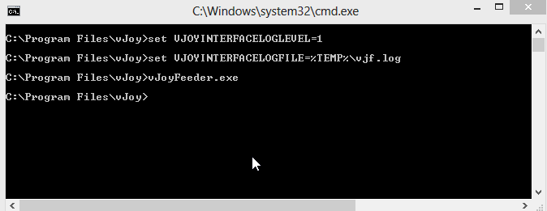

# C# vJoy Feeder/Receptor SDK

*Version 2.1.8 -- November 2016*

**Table of Contents**

[C# vJoy Feeder/Receptor SDK 1](#c-vjoy-feederreceptor-sdk)  
[File listing: 2](#file-listing)  
[Fundamentals: 3](#fundamentals)  
[Reccomended Practices: 4](#reccomended-practices)  
[Test vJoy Driver: 4](#test-vjoy-driver)  
[Test Interface DLL matches vJoy Driver: 4](#test-interface-dll-matches-vjoy-driver)  
[Test vJoy Virtual Devices: 5](#test-vjoy-virtual-devices)  
[Acquire the vJoy Device: 6](#acquire-the-vjoy-device)  
[Feed vJoy Device: 6](#feed-vjoy-device)  
[Relinquish the vJoy Device: 9](#relinquish-the-vjoy-device)  
[Detecting Changes 9](#detecting-changes)  
[Receptor Unit 10](#receptor-unit)  
[Interface Function Reference: 12](#interface-function-reference)  
[General driver data 12](#general-driver-data)  
[Write access to vJoy Device 12](#write-access-to-vjoy-device)  
[vJoy Device properties 13](#vjoy-device-properties)  
[Robust write access to vJoy Devices 15](#robust-write-access-to-vjoy-devices)  
[FFB Functions 16](#ffb-functions)  
[FFB Helper Functions 16](#ffb-helper-functions)  
[Build & Deploy: 21](#build-deploy)  
[Location of vJoyInterface.dll 21](#location-of-vjoyinterface.dll)  
[Logging 22](#logging)  
[Start/Stop Logging. 22](#startstop-logging.)  
[Log File 23](#log-file)  

This SDK includes all that is needed to write a feeder for vJoy version
2.1.8

Check for the latest
[SDK](https://sourceforge.net/projects/vjoystick/files/Beta 2.x/SDK).

##  

## File listing:

  --------------------------------------- -----------------------------------------
                                          

  **c#**                                  C# SDK (This folder)

  **x86**                                 Library folder (x86)

  **x86\\vJoyInterface.dll**              vJoy Interface DLL file (32-bit version)

  **x86\\vJoyInterface.pdb**              Program Database -- Use it for debugging
                                          (32-bit version)

  **x86\\vJoyInterfaceWrap.dll**          vJoy c# wrapper DLL

  **x64**                                 Library folder (x64)

  **x64\\vJoyInterface.dll**              vJoy Interface DLL file (64-bit version)

  **x64\\vJoyInterface.pdb**              Program Database -- Use it for debugging
                                          (64-bit version)

  **x64\\vJoyInterfaceWrap.dll**          vJoy c# wrapper DLL

  **FeederDemoCS**                        Demo Feeder Project (Visual Studio 2008
                                          Express)

  **FeederDemoCS\\Program.cs**            C# code that demonstrates writing a
                                          simple feeder

  **FeederDemoCS\\FeederDemoCS.csproj**   Demo Feeder Project file (Visual Studio
                                          2008 Express)
  --------------------------------------- -----------------------------------------

  ----------------------------------------------- -----------------------------------------
  **FeederDemoCS\\FeederDemoCS.sln**              Demo Feeder solution file (Visual Studio
                                                  2008 Express)

  **FeederDemoCS\\Properties\\AssemblyInfo.cs**   Demo Feeder properties file (Visual
                                                  Studio 2008 Express)
  ----------------------------------------------- -----------------------------------------

## Fundamentals:

This interface and example will enable you to write a C# vJoy feeder.

To write a C/C++ refer to ReadMe file in parent folder.

Features introduced in versions 2.1.6-2.18 are marked with \[NEW\]

It is advisable to start your feeder from the supplied example and make
the needed changes. Here are the five basic steps you might want to
follow:

| Basic steps  |  details |
|--------------|-------------------------------------------------------|  
| **Test Driver**: | Check that the driver is installed and enabled.   |  
|              |                                                       |  
|              | Obtain information about the driver.                  |  
|              |                                                       |  
|              | An installed driver implies at least one vJoy device. |  
|              |                                                       |  
|              | Test if driver matches interface DLL file             |  
|              | (vJoyInterface.dll)                                   |  
|--------------|-------------------------------------------------------|  
| **Test       | Get information regarding one or more devices.        |  
| Virtual      |                                                       |  
| Device(s)**: | Read information about a specific device              |  
|              | capabilities: Axes, buttons and POV hat switches.     |  
|--------------|-------------------------------------------------------|  
| **Device     | Obtain status of a vJoy device.                       |  
| ac           |                                                       |  
| quisition**: | Acquire the device if the device status is *owned* or |  
|              | is *free.*                                            |  
|--------------|-------------------------------------------------------|  
| *            | Inject [position data]{.underline} to a device (as    |  
| *Updating**: | long as the device is owened by the feeder).          |  
|              |                                                       |  
|              | Position data includes the position of the axes,      |  
|              | state of the buttons and state of the POV hat         |  
|              | switches.                                             |  
|--------------|-------------------------------------------------------|  
| **R          | The device is *owned* by the feeder and cannot be fed |  
| elinquishing | by another application until relinquished.            |  
| the          |                                                       |  
| device**:    |                                                       |  
|--------------|-------------------------------------------------------|  

*Notes:*

1.  The interface library file (vJoyInterface.dll) and the wrapper
    library (vJoyInterfaceWrap.dll) must be placed together.

2.  The feeder must use **using** directive:\
    using vJoyInterfaceWrap;

3.  Wrapper only class is vJoy: Start your application by creating a
    **vJoy** object:\
    joystick = new vJoy();

## Reccomended Practices:

### Test vJoy Driver:

Before you start, check if the vJoy driver is installed and check that
it is what you expected:

### 

### Test Interface DLL matches vJoy Driver:

Before you start, check if file vJoyInterface.dll that you link to
matches the vJoy driver that is installed. It is recommended that their
version numbers will be identical.

If you are not interested in the actual values of the respective version
numbers, you can simplify your code by passing NULL to both function
parameters.

### Test vJoy Virtual Devices:

Check if device is installed and what its state:

Now make sure that the axes, buttons (and POV hat switches) are as
expected:

### 

### Acquire the vJoy Device:

Until now you just made inquiries [about]{.underline} the system and
[about]{.underline} the vJoy device status. In order to change the
position of the vJoy device you need to [Acquire]{.underline} it (if it
is not already owned):

### 

### Feed vJoy Device:

The time has come to do some real work: feed the vJoy device with
position data.

There are two approaches:

1.  **Efficient**: Collect position data, place the data in a position
    structure then finally send the data to the device.

2.  **Robust**: Reset the device once then send the position data for
    every control (axis, button,POV) at a time.

The first approach is more efficient but requires more code to deal with
the position structure that may change in the future.

The second approach hides the details of the data fed to the device at
the expence of exessive calls to the device driver.

**Efficient**:

if the structure changes in the future then the code will have to change
too.

**Robust**:

This code is readable and does not relay on any specific structure.
However, the driver is updated with every *SetAxis()* and every
*SetBtn()*.

### Relinquish the vJoy Device:

You must relinquish the device when the driver exits:

### Detecting Changes

It is sometimes necessary to detect changes in the number of available
vJoy devices.

You may define a callback function that will be called whenever such a
change occurs. In order for it to be called, the user-defined callback
function should first be registered by calling function
*RegisterRemovalCB* as in the following example:

Where ChangedCB is the user-defined callback function and label2 is some
C# object.

An example to an implementation of the user-defined callback function
ChangedCB:

This function is called when a process of vJoy device removal starts or
ends and when a process of vJoy device arrival starts or ends. The
function must return as soon as possible.

-   When a process of vJoy device removal starts, Parameter
    *Removed*=TRUE and parameter *First*=TRUE.

-   When a process of vJoy device removal ends, Parameter *Removed*=TRUE
    and parameter *First*=FALSE.

-   When a process of vJoy device arrival starts, Parameter
    *Removed*=FALSE and parameter *First*=TRUE.

-   When a process of vJoy device arrival ends, Parameter *Removed*=
    FALSE and parameter *First*=FALSE .

Parameter *userData* is always an object registered as second parameter
of function *RegisterRemovalCB*.

### Receptor Unit

To take advantage of vJoy ability to process **Force Feedback** (FFB)
data, you need to add a **receptor** unit to the feeder.

The receptor unit receives the FFB data from a **source application**,
and processes the FFB data. The data can be passed on to another entity
(e.g. a physical joystick) or processed in place.

The Receptor is activated by **Acquiring** one or more vJoy devices (if
not acquired yet), then **Starting** the devices\' FFB capabilities and
finally **registering** a single user-defined FFB callback function.

Once registered, the user-defined FFB callback function is called by a
vJoy device every time a new FFB packet arrives from the **source
application**. This function is called in the application thread and is
**blocking**. This means that you must return from the FFB callback
function ASAP -- never wait in this function for the next FFB packet!

The SDK offers you a wide range of FFB helper-functions to process the
FFB packet and a demo application that demonstrates the usage of the
helper-functions. The helper-functions are efficient and can be used
inside the FFB callback function.

Start a vJoy device\' FFB capabilities by calling function
*FfbStart()*.\
Register a user-defined FFB callback function by calling
*FfbRegisterGenCB()*.

The FFB callback function is defined by the user. The function interface
is as follows:

Where *OnEffectObj* is the name of the user-defined callback function.
Parameter *data* is a pointer to a C-language data packet (Type
FFB_DATA) arriving from the vJoy device. Parameter *userData* is a
user-defined object. You are not required to understand the structure of
the FFB_DATA structure -- just pass it to the the various FFB
helper-functions.

**Structure FFB_DATA:**

Normally, you are not required to understand this structure as it is
usually passed to the various helper function. However, you might want
to access the raw FFB packet.

FFB_DATA Fields:

**size**: Size of FFB_DATA structure in bytes\
**cmd**: Reserved\
**data**: Array of size-8 bytes holding the FFB packet.

**FFB Helper Functions:**

These functions receive a pointer to FFB_DATA as their first parameter
and return a **uint** status. The returned value is either ERROR_SUCCESS
on success or other values on failure.

Use these functions to analyze the FFB data packets avoiding direct
access to the raw FFB_DATA structure.

## Interface Function Reference:

### General driver data

The following functions return general data regarding the installed vJoy
device driver. It is recommended to call them when starting your feeder.

bool **vJoyEnabled**();

Returns true if vJoy version 2.x is installed and enabled.

short **GetvJoyVersion**();

Return the version number of the installed vJoy. To be used only after
vJoyEnabled()

string **GetvJoyProductString**();

string **GetvJoyManufacturerString**();

string **GetvJoySerialNumberString**();

To be used only after vJoyEnabled()

bool **DriverMatch**(ref UInt32 DllVer, ref UInt32 DrvVer);

Returns TRUE if vJoyInterface.dll file version and vJoy Driver version
are identical. Otherwise returns FALSE.

Optional output parameter *DllVer*: If a reference to 32-bit unsigned
integer is passed then the value of the **DLL file** version will be
written to this parameter (e.g. 0x205).

Optional output parameter *DrvVer*: If a reference to 32-bit unsigned
integer is passed then the value of the **Driver** version will be
written to this parameter (e.g. 0x205).

void **RegisterRemovalCB**(RemovalCbFunc cb, object data);

This function registers a user-defined **cb** callback fuction that is
called everytime a vJoy device is added or removed.

Parameter *cb* is a reference to the user-defined callback function.

Parameter *data* is a pointer to a user-defined object. The callback
function recieves this object as its third parameter.

The user-defined callback function type definition:

void RemovalCbFunc(bool complete, bool First, object userData);

More in section [Detecting Changes](#detecting-changes).

### Write access to vJoy Device

The following functions access the virtual device by its ID (rID). The
value of rID may vary between 1 and 16.

There may be more than one virtual device installed on a given system.

VJD stands for *Virtual Joystick Device*.

VjdStat **GetVJDStatus**(UInt32 rID);

Returns the status of the specified device

The status can be one of the following values:

-   VJD_STAT_OWN // The vJoy Device is owned by this application.

-   VJD_STAT_FREE // The vJoy Device is NOT owned by any application
    (including this one).

-   VJD_STAT_BUSY // The vJoy Device is owned by another application.\
    // It cannot be acquired by this application.

-   VJD_STAT_MISS // The vJoy Device is missing. It either does not
    exist or the driver is disabled.

-   VJD_STAT_UNKN // Unknown

\[NEW\]

bool **isVJDExists**(UInt32 rID);

Returns TRUE if the specified device exists (Configured and enabled).

Returns FALSE otherwise (Including the following cases: Device does not
exist, disabled, driver not installed)

\[NEW\]

int **GetOwnerPid**(UInt32 rID);

Returns the Process ID (PID) of the process that owns the specified
device.

If the device is owned by a process, then the function returns a
positive integer which is the PID of the owner.

Otherwise, the function returns one of the following negative numbers:

NO_FILE_EXIST (-13): Usually indicates a FREE device (No owner)

NO_DEV_EXIST (-12): Usually indicates a MISSING device

BAD_DEV_STAT (-11): Indicates some internal problem

bool **AcquireVJD**(UInt32 rID);

Acquire the specified device.

Only a device in state VJD_STAT_FREE can be acquired.

If acquisition is successful the function returns TRUE and the device
status becomes VJD_STAT_OWN.

void **RelinquishVJD**(UInt32 rID);

Relinquish the previously acquired specified device.

Use only when device is state VJD_STAT_OWN.

State becomes VJD_STAT_FREE immediately after this function returns.

bool **UpdateVJD**(UInt32 rID, ref JoystickState pData);

Update the position data of the specified device.

Use only after device has been succesfully acquired.

Input parameter is a reference to structure of type JoystickState that
holds the position data.

Returns **true** if device updated.

### vJoy Device properties

The following functions receive the virtual device ID (rID) and return
the relevant data.

The value of rID may vary between 1 and 16. There may be more than one
virtual device installed on a given system.

The return values are meaningful only if the specified device exists

VJD stands for Virtual Joystick Device.

int **GetVJDButtonNumber**(uint rID);

Returns the number of buttons in the specified device.

If function succeeds, returns the number of buttons in the specified
device. Valid values are 0 to 128

If function fails, returns a negative error code:

• NO_HANDLE_BY_INDEX

• BAD_PREPARSED_DATA

• NO_CAPS

• BAD_N\_BTN_CAPS

• BAD_BTN_CAPS

• BAD_BTN_RANGE

int **GetVJDDiscPovNumber**(uint rID);

Returns the number of discrete-type POV hats in the specified device

Discrete-type POV Hat values may be North, East, South, West or neutral

Valid values are 0 to 4 (in version 2.0.1)

int **GetVJDContPovNumber**(uint rID);

Returns the number of continuous-type POV hats in the specified device

continuous-type POV Hat values may be 0 to 35900

Valid values are 0 to 4 (in version 2.0.1)

bool **GetVJDAxisExist**(UInt32 rID, HID_USAGES Axis);

Returns TRUE is the specified axis exists in the specified device

Axis values can be:

HID_USAGES.HID_USAGE_X // X Axis

HID_USAGES.HID_USAGE_Y // Y Axis

HID_USAGES.HID_USAGE_Z // Z Axis

HID_USAGES.HID_USAGE_RX // Rx Axis

HID_USAGES.HID_USAGE_RY // Ry Axis

HID_USAGES.HID_USAGE_RZ // Rz Axis

HID_USAGES.HID_USAGE_SL0 // Slider 0

HID_USAGES.HID_USAGE_SL1 // Slider 1

HID_USAGES.HID_USAGE_WHL // Wheel

### Robust write access to vJoy Devices

The following functions receive the virtual device ID (rID) and return
the relevant data.

These functions hide the details of the position data structure by
allowing you to alter the value of a specific control. The downside of
these functions is that you inject the data to the device serially as
opposed to function *UpdateVJD()*.

The value of rID may vary between 1 and 16. There may be more than one
virtual device installed on a given system.

bool **ResetVJD**(UInt32 rID);

Resets all the controls of the specified device to a set of values.

These values are hard coded in the interface DLL and are currently set
as follows:

-   Axes X,Y & Z: Middle point.

-   All other axes: 0.

-   POV Switches: Neutral (-1).

-   Buttons: Not Pressed (0).

    bool **ResetAll**();

    Resets all the controls of the all devices to a set of values.

    See function Reset VJD for details.

    bool **ResetButtons**(UInt32 rID);

Resets all buttons (To 0) in the specified device.

bool **ResetPovs(**UInt32 **rID)**;

Resets all POV Switches (To -1) in the specified device.

bool **SetAxis**(Int32 Value, UInt32 rID, HID_USAGES Axis);

Write Value to a given axis defined in the specified VDJ.

Axis values can be:

HID_USAGES.HID_USAGE_X // X Axis

HID_USAGES.HID_USAGE_Y // Y Axis

HID_USAGES.HID_USAGE_Z // Z Axis

HID_USAGES.HID_USAGE_RX // Rx Axis

HID_USAGES.HID_USAGE_RY // Ry Axis

HID_USAGES.HID_USAGE_RZ // Rz Axis

HID_USAGES.HID_USAGE_SL0 // Slider 0

HID_USAGES.HID_USAGE_SL1 // Slider 1

HID_USAGES.HID_USAGE_WHL // Wheel

bool **SetBtn**(bool Value, UInt32 rID, uint nBtn);

Write Value (true or false) to a given button defined in the specified
VDJ.

nBtn can range 1-32

bool **SetDiscPov**(Int32 Value, UInt32 rID, uint nPov);

Write Value to a given discrete POV defined in the specified VDJ

**Value** can be one of the following:

0: North (or Forwards)

1: East (or Right)

2: South (or backwards)

3: West (or left)

-1: Neutral (Nothing pressed)

**nPov** selects the destination POV Switch. It can be 1 to 4

bool **SetContPov**(Int32 Value, UInt32 rID, uint nPov);

Write Value to a given continuous POV defined in the specified VDJ

**Value** can be in the range: -1 to 35999. It is measured in units of
one-hundredth a degree. -1 means Neutral (Nothing pressed).

**nPov** selects the destination POV Switch. It can be 1 to 4

### FFB Functions

The following functions are used for accessing and manipulating Force
Feedback data.

void **FfbRegisterGenCB**(FfbCbFunc cb, object data);

Register a FFB callback function that will be called by the driver every
time a FFB data packet arrives.
For additional information see [Receptor Unit section](#receptor-unit).

bool **FfbStart**(UInt32 rID);

Enable the FFB mechanism of the specified VDJ.\
Return **true** on success. Otherwise return **false**.

bool **FfbStop**(UInt32 rID);

Disable the FFB mechanism of the specified VDJ.

NEW\]

bool **IsDeviceFfb**(UInt32 rID);

Return TRUE if specified device supports FFB. Otherwise return FALSE.

\[NEW\]

bool **IsDeviceFfbEffect**(UInt32 rID, UInt32 Effect)

Return TRUE if specified device supports a specific FFB Effect.
Otherwise return FALSE.

The FFB Effect is indicated by its Usage.

List of effect Usages:

HID_USAGE_CONST (0x26): Usage ET Constant Force

HID_USAGE_RAMP (0x27): Usage ET Ramp

HID_USAGE_SQUR (0x30): Usage ET Square

HID_USAGE_SINE (0x31): Usage ET Sine

HID_USAGE_TRNG (0x32): Usage ET Triangle

HID_USAGE_STUP (0x33): Usage ET Sawtooth Up

HID_USAGE_STDN (0x34): Usage ET Sawtooth Down

HID_USAGE_SPRNG (0x40): Usage ET Spring

HID_USAGE_DMPR (0x41): Usage ET Damper

HID_USAGE_INRT (0x42): Usage ET Inertia

HID_USAGE_FRIC (0x43): Usage ET Friction

### FFB Helper Functions

UInt32 **Ffb_h\_DeviceID**(IntPtr Packet, ref int DeviceID);

Get the origin of the FFB data packet.

If valid device ID was found then returns ERROR_SUCCESS and sets the ID
(Range 1-15) in **DeviceID**.\
If Packet is NULL then returns ERROR_INVALID_PARAMETER. DeviceID is
undefined.\
If Packet is malformed or Device ID is out of range then returns
ERROR_INVALID_DATA. DeviceID is undefined.

UInt32 **Ffb_h\_Type**(IntPtr Packet, ref FFBPType Type);

Get the type of the FFB data packet.

**Type** may be one of the following:

// Write

PT_EFFREP // Usage Set Effect Report

PT_ENVREP // Usage Set Envelope Report

PT_CONDREP // Usage Set Condition Report

PT_PRIDREP // Usage Set Periodic Report

PT_CONSTREP // Usage Set Constant Force Report

PT_RAMPREP // Usage Set Ramp Force Report

PT_CSTMREP // Usage Custom Force Data Report

PT_SMPLREP // Usage Download Force Sample

PT_EFOPREP // Usage Effect Operation Report

PT_BLKFRREP // Usage PID Block Free Report

PT_CTRLREP // Usage PID Device Control

PT_GAINREP // Usage Device Gain Report

PT_SETCREP // Usage Set Custom Force Report

// Feature

PT_NEWEFREP // Usage Create New Effect Report

PT_BLKLDREP // Usage Block Load Report

PT_POOLREP // Usage PID Pool Report

If valid Type was found then returns ERROR_SUCCESS and sets **Type**.\
If Packet is NULL then returns ERROR_INVALID_PARAMETER. Feature is
undefined.\
If Packet is malformed then returns ERROR_INVALID_DATA. Feature is
undefined.

UInt32 **Ffb_h\_Packet**(IntPtr Packet, ref UInt32 Type, ref Int32
DataSize, ref Byte\[\] Data);

Extract the raw FFB data packet and the command type (Write/Set
Feature).

If valid Packet was found then returns ERROR_SUCCESS and -\
Sets **Type** to IOCTRL value (Expected values are
IOCTL_HID_WRITE_REPORT and IOCTL_HID_SET_FEATURE).\
Sets **DataSize** to the size (in bytes) of the payload data
(FFB_DATA.data ).\
Sets **Data** to the payload data (FFB_DATA.data ) - this is an array of
bytes.\
If Packet is NULL then returns ERROR_INVALID_PARAMETER. Output
parameters are undefined.\
If Packet is malformed then returns ERROR_INVALID_DATA. Output
parameters are undefined.

UInt32 **Ffb_h\_EBI**(IntPtr Packet, ref Int32 Index);

Get the Effect Block Index

If valid Packet was found then returns ERROR_SUCCESS and sets **Index**
to the value of Effect Block Index (if applicable). Expected value is
\'1\'.\
If Packet is NULL then returns ERROR_INVALID_PARAMETER. Output
parameters are undefined.\
If Packet is malformed or does not contain an Effect Block Index then
returns ERROR_INVALID_DATA. Output parameters are undefined.

UInt32 **Ffb_h\_Eff_Const**(IntPtr Packet, ref FFB_EFF_CONST Effect);

Get parameters of an Effect of type Constant (PT_EFFREP)

Effect structure (FFB_EFF_CONST) definition:
```
public struct FFB_EFF_CONST

{

\[FieldOffset(0)\]

public Byte EffectBlockIndex;

\[FieldOffset(4)\]

public FFBEType EffectType;

\[FieldOffset(8)\]

public UInt16 Duration;// Value in milliseconds. 0xFFFF means infinite

\[FieldOffset(10)\]

public UInt16 TrigerRpt;

\[FieldOffset(12)\]

public UInt16 SamplePrd;

\[FieldOffset(14)\]

public Byte Gain;

\[FieldOffset(15)\]

public Byte TrigerBtn;

\[FieldOffset(16)\]

public bool Polar; // How to interpret force direction Polar (0-360°)

//or Cartesian (X,Y)

\[FieldOffset(20)\]

public Byte Direction; // Polar direction: (0x00-0xFF correspond to
0-360°)

\[FieldOffset(20)\]

public Byte DirX; // X direction: Positive values are To the right

// of the center (X); Negative are Two\'s complement

\[FieldOffset(21)\]

public Byte DirY; // Y direction: Positive values are below the center
(Y);

// Negative are Two\'s complement

}
```
If Constant Effect Packet was found then returns ERROR_SUCCESS and fills
structure **Effect\
**If Packet is NULL then returns ERROR_INVALID_PARAMETER. Output
parameters are undefined.\
If Packet is malformed then returns ERROR_INVALID_DATA. Output
parameters are undefined.
```
UInt32 **Ffb_h\_Eff_Ramp**(IntPtr Packet, ref FFB_EFF_RAMP RampEffect);

Get parameters of an Effect of type Ramp (PT_RAMPREP)

Effect structure (FFB_EFF_RAMP) definition:

public struct FFB_EFF_RAMP

{

public Byte EffectBlockIndex;

public Byte Start; // The Normalized magnitude at the start of the
effect

public Byte End; // The Normalized magnitude at the end of the effect

}
```
If Ramp effect Packet was found then returns ERROR_SUCCESS and fills
structure Effect.\
If Packet is NULL then returns ERROR_INVALID_PARAMETER. Output
parameters are undefined.\
If Packet is malformed then returns ERROR_INVALID_DATA. Output
parameters are undefined.

UInt32 **Ffb_h\_EffOp**(IntPtr Packet, ref FFB_EFF_OP Operation);

Get parameters of an Effect of type Operation (PT_EFOPREP) that describe
the effect operation (Start/Solo/Stop) and loop count.

Effect structure (FFB_EFF_OP) definition:

public struct FFB_EFF_OP

{

\[FieldOffset(0)\]

public Byte EffectBlockIndex;

\[FieldOffset(4)\]

public FFBOP EffectOp;

\[FieldOffset(8)\]

public Byte LoopCount;

}

If Operation Effect Packet was found then returns ERROR_SUCCESS and
fills structure Operation- this structure holds Effect Block Index,
Operation(Start, Start Solo, Stop) and Loop Count.\
If Packet is NULL then returns ERROR_INVALID_PARAMETER. Output
parameters are undefined.\
If Packet is malformed then returns ERROR_INVALID_DATA. Output
parameters are undefined.

UInt32 **Ffb_h\_Eff_Period**(IntPtr Packet, ref FFB_EFF_PERIOD Effect);

Get parameters of an Effect of type Periodic (PT_PRIDREP) that describe
the periodic attribute of an effect.

Effect structure (FFB_EFF_PERIOD) definition:

public struct FFB_EFF_PERIOD

{

\[FieldOffset(0)\]

public Byte EffectBlockIndex;

\[FieldOffset(1)\]

public Byte Magnitude;

\[FieldOffset(2)\]

public Byte Offset;

\[FieldOffset(3)\]

public Byte Phase;

\[FieldOffset(4)\]

public UInt16 Period;

}
```
If Periodic Packet was found then returns ERROR_SUCCESS and fills
structure Effect -- this structure holds Effect Block Index, Magnitude,
Offset, Phase and period.\
If Packet is NULL then returns ERROR_INVALID_PARAMETER. Output
parameters are undefined.\
If Packet is malformed then returns ERROR_INVALID_DATA. Output
parameters are undefined.
```
UInt32 **Ffb_h\_Eff_Cond**(IntPtr Packet, ref FFB_EFF_COND Condition);

Get parameters of an Effect of type Conditional (PT_CONDREP).

Effect structure (FFB_EFF_COND) definition:

public struct FFB_EFF_COND

{

public Byte EffectBlockIndex;

\[FieldOffset(4)\]

public bool isY;

\[FieldOffset(8)\]

public Byte CenterPointOffset; // CP Offset: Range -10000 to 10000

\[FieldOffset(9)\]

public Byte PosCoeff; // Positive Coefficient: Range -10000 to 10000

\[FieldOffset(10)\]

public Byte NegCoeff; // Negative Coefficient: Range -10000 to 10000

\[FieldOffset(11)\]

public Byte PosSatur; // Positive Saturation: Range 0 -- 10000

\[FieldOffset(12)\]

public Byte NegSatur; // Negative Saturation: Range 0 -- 10000

\[FieldOffset(13)\]

public Byte DeadBand; // Dead Band: : Range 0 -- 10000

}
```
If Condition Packet was found then returns ERROR_SUCCESS and fills
structure Condition - this structure holds Effect Block Index, Direction
(X/Y), Centre Point Offset, Dead Band and other conditions.\
If Packet is NULL then returns ERROR_INVALID_PARAMETER. Output
parameters are undefined.\
If Packet is malformed then returns ERROR_INVALID_DATA. Output
parameters are undefined.
```
UInt32 **Ffb_h\_Eff_Envlp**(IntPtr Packet, ref FFB_EFF_ENVLP Envelope);

Get parameters of an Effect of type Envelope (PT_ENVREP).

Effect structure (FFB_EFF_ENVLP) definition:

public struct FFB_EFF_ENVLP

{

\[FieldOffset(0)\]

public Byte EffectBlockIndex;

\[FieldOffset(1)\]

public Byte AttackLevel;

\[FieldOffset(2)\]

public Byte FadeLevel;

\[FieldOffset(4)\]

public UInt16 AttackTime;

\[FieldOffset(6)\]

public UInt16 FadeTime;

}
```
If Envelope Packet was found then returns ERROR_SUCCESS and fills
structure Envelope\
If Packet is NULL then returns ERROR_INVALID_PARAMETER. Output
parameters are undefined.\
If Packet is malformed then returns ERROR_INVALID_DATA. Output
parameters are undefined.
```
UInt32 **Ffb_h\_EffNew**(IntPtr Packet, ref FFBEType Effect);
```
Get the type of the next effect. Parameter **Effect** can get one of the
following values:

ET_NONE = 0 // No Force

ET_CONST = 1 // Constant Force

ET_RAMP = 2 // Ramp

ET_SQR = 3 // Square

ET_SINE = 4 // Sine

ET_TRNGL = 5 // Triangle

ET_STUP = 6 // Sawtooth Up

ET_STDN = 7 // Sawtooth Down

ET_SPRNG = 8 // Spring

ET_DMPR = 9 // Damper

ET_INRT = 10 // Inertia

ET_FRCTN = 11 // Friction

ET_CSTM = 12 // Custom Force Data

If valid Packet was found then returns ERROR_SUCCESS and sets the new
**Effect** type\
If Packet is NULL then returns ERROR_INVALID_PARAMETER. Output
parameters are undefined.\
If Packet is malformed then returns ERROR_INVALID_DATA. Output
parameters are undefined.

\[NEW\]
```
UInt32 **Ffb_h\_Eff_Constant**(IntPtr Packet, ref FFB_EFF_CONSTANT
ConstantEffect);
```
Get parameters of an Effect of type Constant (PT_CONSTREP).\
If Constant Packet was found then returns ERROR_SUCCESS and fills
structure ConstantEffect\
If Packet is NULL then returns ERROR_INVALID_PARAMETER. Output
parameters are undefined.\
If Packet is malformed then returns ERROR_INVALID_DATA. Output
parameters are undefined.

UInt32 **Ffb_h\_DevCtrl**(IntPtr Packet, ref FFB_CTRL Control);

Get device-wide control instructions. **Control** can get one of the
following values:

CTRL_ENACT = 1 // Enable all device actuators.

CTRL_DISACT = 2 // Disable all the device actuators.

CTRL_STOPALL = 3 // Stop All Effects­ Issues a stop on every running
effect.

CTRL_DEVRST = 4 // Device Reset

// Clears any device paused condition,

// enables all actuators and clears all effects from memory.

CTRL_DEVPAUSE = 5 // Device Pause

// All effects on the device are paused

// at the current time step.

CTRL_DEVCONT = 6 // Device Continue

// All effects that running when the

// device was paused are restarted from their last time step.

UInt32 Ffb_h\_DevGain(IntPtr Packet, ref Byte Gain);

Get device Global gain in parameter **Gain**.

If valid Packet was found then returns ERROR_SUCCESS and gets the device
global gain.\
If Packet is NULL then returns ERROR_INVALID_PARAMETER. Output
parameters are undefined.\
If Packet is malformed then returns ERROR_INVALID_DATA. Output
parameters are undefined.

## Build & Deploy: {#build-deploy .list-paragraph}

The quickest way to build your project is to start from the supplied
demo project written in C# under Visual Studio 2008 Express. It will
compile as-is for x86/x64 target machines.

When you deploy your feeder, don\'t forget to supply the user with files
vJoyInterface.dll and vJoyInterfaceWrap.dll of the [correct
bitness]{.underline}. They should be located on the target machine\'s
DLL search path. Usually meaning the same directory as your feeder.

### Location of vJoyInterface.dll

vJoy folders are pointed at by registry Entries located under key:\
`HKEY_LOCAL_MACHINE\\SOFTWARE\\Microsoft\\Windows\\CurrentVersion\\Uninstall\\{8E31F76F-74C3-47F1-9550-E041EEDC5FBB}\_is1`

| **Entry**  | **Default Value**  | **Notes**                          |  
|------------|--------------------|------------------------------------|  
| Insta      | C:\\Program        | vJoy root folder:\                 |  
| llLocation | Files\\vJoy\\      | Location of vJoy driver installer  |  
|            |                    | and uninstaller                    |  
| DllX       | C:\\Program        | -   Location of 64-bit utilities   |  
| 64Location | Files\\vJoy\\x64   |     and libraries                  |  
|            |                    |                                    |  
|            |                    | -   Only on 64-bit Machines        |  
| DllX       | C:\\Program        | -   Location of 32-bit utilities   |  
| 86Location | Files\\vJoy\\x86   |     and libraries                  |  
|            |                    |                                    |  
|            |                    | -   On 32-bit and 64-bit Machines  |  

Note that on 64-bit machine you are capable of developing both 32-bit
and 64-bit feeders.

You can assume that DLL files are located in sub-folders x64 and x32
under vJoy root folder.

## Logging

Logging of vJoyInterface.dll activity into a log file is an option.\
Use this feature for debugging purposes only. It accumulates data into
the log file and generally slows down the system.

This feature is intended both for helping you develop your feeder and to
collect data at the user\'s location -- provided the user is willing to
trigger logging for you. By default, logging state is OFF.

### Start/Stop Logging.

To start logging, there are one or two system environment variables that
have to be changed before the feeder (Or any other application calling
vJoyInterface.dll) is started.

> • VJOYINTERFACELOGLEVEL:\
> Any positive value will trigger logging.\
> Set to 0 to stop logging.
>
> • VJOYINTERFACELOGFILE (Optional):\
> If set, this is the full path to the log file.\
> Default Path: %TEMP%\\vJoyInterface.log

**Example**:


**Notes**:

• This session of vJoyFeeder will log into the given file.

• If the file exists, it will append the new data to the existing file.

• To stop logging, kill vJoyFeeder and then close this window.

**Limitations**:

• Logging begins on the application\'s first call to function
AcquireVJD()

• If VJOYINTERFACELOGFILE is not defined, all applications that call
AcquireVJD() will write to the same

default output file.

### Log File

The log file contains information about vJoyInterface.dll values, states
and functions. It is mainly useful in

conjunction with the code.

Here is a snippet of a log file:

You can see the end of one process (Process ids are in brackets) and the
beginning of a second process. The first line referring the second
project is highlighted, and it indicates the command this process is
carrying out.

Every line in the log file starts with the process id and followed by an
error level string such as Info and a column.

The next string is usually the name of the function (e.g. isRawDevice)
and its significant parameters.

For full understanding of the printout you should refer to the source
file.
